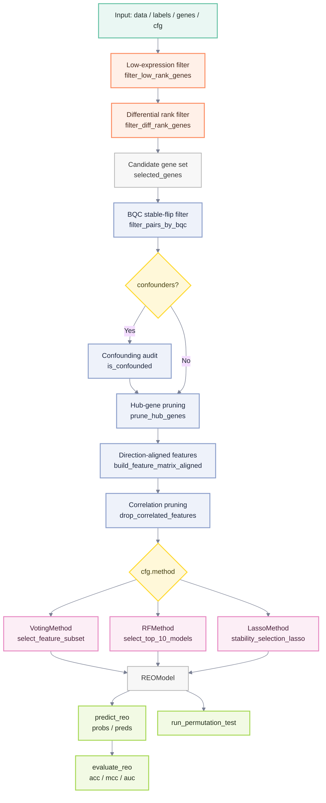
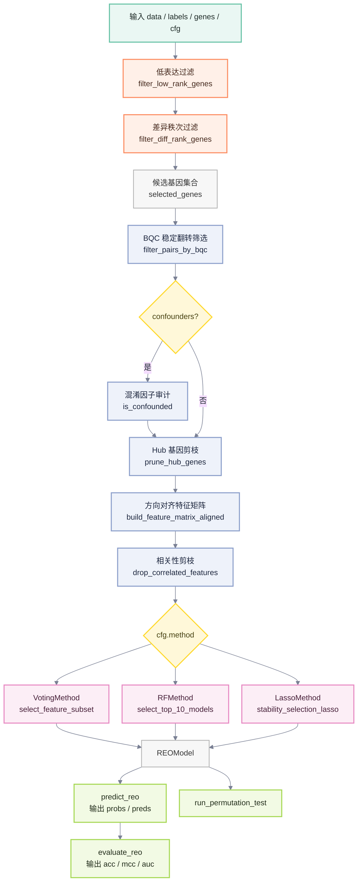

# REOB: Relative Expression Ordering-based Biomarker Identification

REOB is a Julia package for binary classification biomarker discovery based on
Relative Expression Ordering (REO).  It identifies gene pairs whose expression
ordering is stable in control samples but reversed in case samples, and uses
these pairs as binary features for sample-level prediction.

Because REO uses within-sample gene expression as a reference, it does not
depend on absolute expression values and typically does not require batch
correction, making it suitable for cross-dataset and cross-platform modelling.
The same input structure applies to protein expression or other continuous
quantitative data.

REOB implements model training, evaluation, and significance testing, and
includes TSP, k-TSP, and AUC-TSP as baseline methods from the literature.

## Algorithm Overview

For a sample $s$ and the $i$-th direction-aligned gene pair $(A_i, B_i)$,
REOB converts the ordering into a binary feature:

$$
x_i(s) = \mathbf{1}\{E_{A_i,s} > E_{B_i,s}\}
$$

where $E_{A_i,s}$ and $E_{B_i,s}$ are the expression values of genes $A_i$
and $B_i$ in sample $s$.  $x_i(s)=1$ indicates the pair supports the positive
class; $x_i(s)=0$ indicates it does not.

REOB supports three classification strategies:

- **VotingMethod** — equal-weight majority vote.  With $n$ selected pairs the
  sample score is

$$
\operatorname{score}(s) = \frac{1}{n}\sum_{i=1}^{n} x_i(s) + b
$$

  where $b$ is a bias calibrated during training; when $b=0$ this reduces to
  ordinary majority voting.

- **RFMethod** — random-forest stump stability selection with normalised
  feature importance as weights:

$$
\operatorname{score}(s) = \sum_{i=1}^{n} w_i x_i(s), \qquad
w_i \ge 0,\quad \sum_{i=1}^{n} w_i = 1
$$

- **LassoMethod** — Lasso/Elastic Net stability selection with a logistic
  (sigmoid) output:

$$
\operatorname{score}(s) =
\sigma\!\left(\sum_{i=1}^{n} w_i x_i(s) + b\right), \qquad
\sigma(z)=\frac{1}{1+\exp(-z)}
$$

The final classification rule is:

$$
\hat{y}(s)=
\begin{cases}
1, & \operatorname{score}(s) \ge 0.5,\\
0, & \operatorname{score}(s) < 0.5.
\end{cases}
$$

## Input Format

All training and prediction functions expect three objects:

- `data` — expression matrix, **genes × samples**.
- `labels` — binary vector (0 / 1), one entry per sample column.
- `genes` — gene-name vector, one entry per row of `data`.

## Quick Start

```julia
using REOB

data, labels, genes = generate_test_data(1000, 200)

cfg = REOConfig(
    method = VotingMethod,
    bqc_threshold = 2.0,
    p0_threshold = 0.1,
)

model = fit_reo(data, labels, genes, cfg)
pred  = predict_reo(model, data, genes)
metrics = evaluate_reo(model, data, genes, labels)
```

## Pipeline

1. **Low-expression filter** — remove genes whose median percentile rank falls
   below a threshold.
2. **Differential rank filter** — keep genes with the largest class-wise
   mean-rank difference.
3. **BQC pair filter** — Bayesian Quality Control retains gene pairs whose
   ordering is stable in controls and stably reversed in cases.
4. **Confounding-factor audit** *(optional)* — remove pairs significantly
   associated with covariates (e.g. age, sex, batch).
5. **Hub-gene pruning** — limit how often a single gene may appear across
   candidate pairs.
6. **Direction-aligned feature matrix** — convert orderings to binary features
   oriented toward the positive class.
7. **Model training** — VotingMethod, RFMethod, or LassoMethod.



## API Reference

| API | Description |
| --- | --- |
| `REOConfig` | Training configuration |
| `fit_reo` | Train an REOB model |
| `predict_reo` | Return prediction probabilities and binary labels |
| `evaluate_reo` | Return accuracy, MCC, AUC, and predictions |
| `run_permutation_test` | Estimate significance of observed MCC via label permutation |
| `fit_tsp` / `predict_tsp` / `evaluate_tsp` | TSP baseline |
| `fit_ktsp` / `predict_ktsp` / `evaluate_ktsp` | k-TSP baseline |
| `fit_auctsp` / `predict_auctsp` / `evaluate_auctsp` | AUC-TSP baseline |

## Testing

```bash
julia --project=REOB -e 'using Pkg; Pkg.test()'
```

Tests cover REOB training / prediction / evaluation, the filtering pipeline,
permutation testing, TSP-family models, and the VotingMethod feature search.

## REOConfig Parameter Guide

A field in `REOConfig` does not guarantee the training code reads it.
Always verify against the source when tuning.

### Parameters

#### `method`

Default: `RFMethod`.  Selects the training branch for `fit_reo`: `VotingMethod`,
`RFMethod`, or `LassoMethod`.  Ignored by TSP / k-TSP / AUC-TSP.

#### `low_rank_q`

Default: `0.2`.  Percentile-rank threshold for low-expression gene removal.
Used by `fit_reo` and all TSP variants.  Range: `0.0 ≤ low_rank_q < 1.0`.

#### `top_diff_n`

Default: `5000`.  Number of top differentially-ranked genes to retain.
Used by `fit_reo` and all TSP variants.  The candidate-pair count scales as
≈ N(N−1)/2, so large values are slow.

#### `bqc_threshold`

Default: `3.0`.  Minimum enhanced-BQC score for gene-pair retention.
Only affects the REOB main pipeline (not TSP).  Higher is stricter.

#### `p0_threshold`

Default: `0.2`.  Minimum |p0 − 0.5| for control-group ordering stability.
Only affects the REOB main pipeline.  Range: `0.0 ≤ p0_threshold < 0.5`.

#### `p_val_cutoff`

Default: `0.05`.  Significance threshold for the confounding-factor audit.
Only used when `fit_reo(...; confounders=...)` is called.  Range: `0.01–0.1`.

#### `max_occurrence`

Default: `2`.  Maximum times a single gene may appear across candidate pairs.
Only affects the REOB main pipeline.  Range: `1–5`.

#### `cor_threshold`

Default: `0.90`.  Pearson correlation threshold for pruning redundant binary
features.  Only affects the REOB main pipeline.  Range: `0.8–0.99`.

#### `ss_iterations`

Default: `1000`.  Number of stability-selection iterations (RF / Lasso).
Ignored by VotingMethod.  Range: `5–1000`.

#### `ss_ratio`

Default: `0.8`.  Per-class sub-sampling ratio (RF / Lasso).  Ignored by
VotingMethod.  Range: `0.5–1.0` (do not set to 1.0).

#### `ss_threshold`

Default: `0.7`.  Minimum selection frequency to retain a feature (Lasso only).
Range: `0.0–1.0`.

#### `target_n`

Default: `15`.  Target number of final features (RF / Lasso).  Ignored by
VotingMethod.  Range: `5–30`.

#### `verbose`

Default: `false`.  Print diagnostic messages when `true`.

### Recommended Configurations

#### VotingMethod

```julia
cfg = REOConfig(
    method = VotingMethod,
    low_rank_q = 0.2,
    top_diff_n = 1000,
    bqc_threshold = 2.0,
    p0_threshold = 0.1,
    max_occurrence = 2,
    cor_threshold = 0.90,
)
```

VotingMethod does not use sub-sampling; `ss_iterations`, `ss_ratio`,
`ss_threshold`, and `target_n` have no effect.  If more than 128 candidate
features remain, only the first 128 are passed to the voting search.

#### RFMethod

```julia
cfg = REOConfig(
    method = RFMethod,
    ss_iterations = 500,
    ss_ratio = 0.8,
    target_n = 15,
)
```

#### LassoMethod

```julia
cfg = REOConfig(
    method = LassoMethod,
    ss_iterations = 500,
    ss_ratio = 0.75,
    ss_threshold = 0.6,
    target_n = 15,
)
```

#### TSP / k-TSP / AUC-TSP

```julia
cfg = REOConfig(
    low_rank_q = 0.0,
    top_diff_n = 500,
)
```

TSP variants use only `low_rank_q`, `top_diff_n`, and `verbose`.
The number of pairs in k-TSP / AUC-TSP is controlled by the `k_max` function
argument.

### Tuning Tips

- **No pairs after BQC**: lower `bqc_threshold`, then `p0_threshold`; if still
  empty, lower `low_rank_q` or increase `top_diff_n`.
- **Too slow**: reduce `top_diff_n`; for RF/Lasso also reduce `ss_iterations`.
- **Too many candidates**: raise `bqc_threshold` or `p0_threshold`; lower
  `max_occurrence` or `cor_threshold`.
- **Unstable results**: fix the random seed and increase `ss_iterations`.


---

# REOB: Relative Expression Ordering-based Biomarker Identification

REOB（Relative Expression Ordering-based Biomarker identification algorithm）是一个 Julia 实现的二分类生物标志识别算法包。它基于基因对表达秩序关系（Relative Expression Ordering，REO），筛选在对照组（阴性样本）中表达秩序稳定、但在病例组（阳性样本）中秩序关系反转的基因对，用于样本分类预测。

REO 方法使用样本内基因作为参照，不依赖基因表达绝对值，因此通常不需要对原始数据做批次校正，适合跨数据集和跨定量技术平台的建模场景。除基因表达矩阵外，同样的输入结构也可用于蛋白表达矩阵等连续定量数据。

REOB 包实现了模型训练、验证评估、显著性检验等功能模块，并提供文献中的 TSP、k-TSP 和 AUC-TSP 作为传统秩序基因对筛选基线方法。

## 算法原理

对样本 $s$ 和第 $i$ 个方向已对齐的基因对 $(A_i, B_i)$，REOB 将其转换为二值特征：

$$
x_i(s) = \mathbf{1}\{E_{A_i,s} > E_{B_i,s}\}
$$

其中 $E_{A_i,s}$ 和 $E_{B_i,s}$ 分别表示样本 $s$ 中基因 $A_i$ 与 $B_i$ 的表达量；$x_i(s)=1$ 表示该基因对支持阳性类别，$x_i(s)=0$ 表示不支持阳性类别。

REOB 支持三种基于 REO 特征的分类策略：

- `VotingMethod`：多数投票方法。若最终选择 $n$ 个基因对，则样本评分为

$$
\text{score}(s) = \frac{1}{n}\sum_{i=1}^{n} x_i(s) + b
$$

其中 $b$ 为训练阶段根据投票阈值校准得到的偏置；当 $b=0$ 时，该式退化为普通等权多数投票（current default）。

- `RFMethod`：基于随机森林(每个‘森林’仅一个节点，即‘随机树桩’)模型筛选稳定基因对，并使用归一化特征重要性作为权重：

$$
\text{score}(s) = \sum_{i=1}^{n} w_i x_i(s), \qquad
w_i \ge 0,\quad \sum_{i=1}^{n} w_i = 1
$$

- `LassoMethod`：使用 Lasso/Elastic Net 路径进行稳定性选择，并通过 Logistic 映射输出阳性概率：

$$
\text{score}(s) =
\sigma\left(\sum_{i=1}^{n} w_i x_i(s) + b\right), \qquad
\sigma(z)=\frac{1}{1+\exp(-z)}
$$

最终分类规则为：

$$
\hat{y}(s)=
\begin{cases}
1, & \text{score}(s) \ge 0.5,\\
0, & \text{score}(s) < 0.5.
\end{cases}
$$

## 数据约定

模型训练时，需要如下三种数据。

- 表达矩阵 `data` 使用 `基因 × 样本` 布局。
- 标签 `labels` 为二分类向量，取值为 `0` 和 `1`，与 `data` 的列顺序一一对应。
- 基因名 `genes` 与 `data` 的行顺序一一对应。

## 快速开始

```julia
using REOB

# 生成模拟数据
data, labels, genes = generate_test_data(1000, 200)

# 参数配置
cfg = REOConfig(
    method = VotingMethod,
    bqc_threshold = 2.0,
    p0_threshold = 0.1,
)

# 训练
model = fit_reo(data, labels, genes, cfg)

# 预测
pred = predict_reo(model, data, genes)

# 评估
metrics = evaluate_reo(model, data, genes, labels)
```

## REOB 基本流程

1. 低表达过滤：按样本内表达秩分位去除低表达基因。
2. 差异秩次过滤：保留两类样本平均秩分位差异较大的基因。
3. BQC 过滤：基于贝叶斯质量控制筛选稳定翻转的基因对。
4. 混淆因子审计(可选)：剔除与协变量显著相关的基因对。
5. hub 基因剪枝：限制同一基因重复出现在过多候选对子中。
6. 特征构建与方向对齐：将基因对序关系转换为样本级二值特征。
7. 模型训练：支持 `VotingMethod`、`RFMethod` 和 `LassoMethod`。



## 主要 API

| API | 说明 |
| --- | --- |
| `REOConfig` | REOB 训练配置 |
| `fit_reo` | 训练 REOB 模型 |
| `predict_reo` | 返回预测概率/投票分数和布尔预测 |
| `evaluate_reo` | 返回准确率、MCC、AUC 和预测结果 |
| `run_permutation_test` | 通过标签置换估计观测 MCC 的显著性 |
| `fit_tsp` / `predict_tsp` / `evaluate_tsp` | TSP 基线 |
| `fit_ktsp` / `predict_ktsp` / `evaluate_ktsp` | k-TSP 基线 |
| `fit_auctsp` / `predict_auctsp` / `evaluate_auctsp` | AUC-TSP 基线 |

## 测试

```bash
julia --project=REOB -e 'using Pkg; Pkg.test()'
```

测试覆盖 REOB 训练/预测/评估、过滤流程、置换检验、TSP 系列模型和多数投票特征搜索。

## REOConfig 参数说明

本文档按当前实现说明 `REOConfig` 参数的实际作用。重点注意：字段存在不等于训练代码已经读取，调参应以源码实际使用情况为准。

### 参数说明

#### `method`

默认值为 `RFMethod`。只对 `fit_reo` 生效，用来选择 `VotingMethod`、`RFMethod` 或 `LassoMethod` 分支；TSP、k-TSP、AUC-TSP 不读取该参数。需要规则最透明时选 `VotingMethod`，需要树桩加权模型时选 `RFMethod`，需要稀疏线性权重时选 `LassoMethod`。

#### `low_rank_q`

默认值为 `0.2`。用于低表达秩过滤，`fit_reo` 和 TSP 系列都会使用。推荐范围是 `0.0 <= low_rank_q < 1.0`；候选基因太少时降到 `0.1` 或 `0.0`，低表达噪声较多时可升到 `0.3` 左右。

#### `top_diff_n`

默认值为 `5000`。用于保留两类平均秩差最大的前 N 个基因，`fit_reo` 和 TSP 系列都会使用。必须是正整数；值越大越慢，因为候选基因对规模约为 `N*(N-1)/2`。调试可用 `100-1000`，常规 REOB 可用 `1000-5000`，TSP 系列建议更小。

#### `bqc_threshold`

默认值为 `3.0`。用于 REOB 主流程的 BQC 稳定翻转基因对过滤；Voting、RF、Lasso 都会间接受影响，TSP 系列不使用。该值越大越严格；BQC 后没有基因对时可降到 `2.0` 或 `1.0`，候选过多时可升高。

#### `p0_threshold`

默认值为 `0.2`。用于要求对照组序关系远离 `0.5`，只在 REOB 主流程的 BQC 阶段生效。推荐范围是 `0.0 <= p0_threshold < 0.5`；默认相当于保留 `p0 <= 0.3` 或 `p0 >= 0.7` 的稳定关系。无基因对时降低，候选太多时升高。

#### `p_val_cutoff`

默认值为 `0.05`。仅当调用 `fit_reo(...; confounders=...)` 时生效，用于混淆因子审计。常用范围是 `0.01-0.1`；值越大，剔除与协变量相关的可疑基因对越多。

#### `max_occurrence`

默认值为 `2`。限制单个基因最多出现在多少个候选基因对中，只在 REOB 主流程生效。必须是正整数；解释性优先可用 `1-2`，最终特征太少时可升到 `3-5`。

#### `cor_threshold`

默认值为 `0.90`。用于删除高度相关的二值 REO 特征，只在 REOB 主流程生效。推荐范围是 `0.8-0.99`；值越低剪枝越强，特征太少时升高。

#### `ss_iterations`

默认值为 `1000`。RF 和 Lasso 会读取，用于子采样迭代次数；VotingMethod 不使用子采样，因此无需设置。调试可用 `5-50`，常规可用 `300-1000`；值越大结果越稳定，但运行越慢。

#### `ss_ratio`

默认值为 `0.8`。RF 和 Lasso 会读取，用于每轮分层子采样比例；VotingMethod 无需设置。推荐范围是 `0.5 < ss_ratio < 1.0`；小样本可用 `0.6-0.75` 保留 OOB 样本，不建议设为 `1.0`。

#### `ss_threshold`

默认值为 `0.7`。当前只在 LassoMethod 中用于稳定性选择阈值；VotingMethod 和 RFMethod 都无需设置。推荐范围是 `0.0-1.0`；Lasso 选不到特征时降低，特征太多时升高。

#### `target_n`

默认值为 `15`。当前 RF 和 Lasso 会读取；VotingMethod 不读取，因此不能用它直接控制 Voting 的最终特征数。必须是正整数，常用 `5-30`；RF 中也影响每轮森林规模，Lasso 中用于选择路径位置和 fallback 数量。

#### `fisher_n_top`

默认值为 `5000`。这是 Fisher 基因对筛选的预留参数；当前 `fit_reo` 主流程使用 BQC，不读取该字段，通常不用设置。

#### `verbose`

默认值为 `false`。用于控制筛选、训练和部分评估日志。调试时设为 `true`，批量运行时保持 `false`。

### 按算法推荐配置

#### VotingMethod

```julia
cfg = REOConfig(
    method = VotingMethod,
    low_rank_q = 0.2,
    top_diff_n = 1000,
    bqc_threshold = 2.0,
    p0_threshold = 0.1,
    max_occurrence = 2,
    cor_threshold = 0.90,
)
```

说明：VotingMethod 当前不使用子采样，`ss_iterations`、`ss_ratio`、`ss_threshold` 无需设置；`target_n` 也不直接控制最终特征数。若候选特征超过 `128`，算法选取前 BQC打分前`128` 个基因对，进入 Voting 模型构建。

#### RFMethod

```julia
cfg = REOConfig(
    method = RFMethod,
    ss_iterations = 500,
    ss_ratio = 0.8,
    target_n = 15,
)
```

说明：RF 读取 `ss_iterations`、`ss_ratio`、`target_n`。

#### LassoMethod

```julia
cfg = REOConfig(
    method = LassoMethod,
    ss_iterations = 500,
    ss_ratio = 0.75,
    ss_threshold = 0.6,
    target_n = 15,
)
```

说明：Lasso 读取 `ss_iterations`、`ss_ratio`、`ss_threshold`、`target_n`。

#### TSP / k-TSP / AUC-TSP

```julia
cfg = REOConfig(
    low_rank_q = 0.0,
    top_diff_n = 500,
)
```

说明：TSP 系列只使用 `low_rank_q`、`top_diff_n` 和预筛选日志相关的 `verbose`。`method`、BQC、`ss_`、`target_n` 等参数都不影响 TSP 系列；`fit_ktsp` 和 `fit_auctsp` 的对子数量由函数参数 `k_max` 控制。

### 常见调参方向

- BQC 后没有基因对：先降低 `bqc_threshold`，再降低 `p0_threshold`，必要时降低 `low_rank_q` 或增加 `top_diff_n`。
- 运行太慢：优先降低 `top_diff_n`；RF/Lasso 可降低 `ss_iterations`。
- 候选特征过多：升高 `bqc_threshold` 或 `p0_threshold`，降低 `max_occurrence` 或 `cor_threshold`。
- 结果波动大：固定随机种子，并增加 `ss_iterations`。

