# REOBiomarker.jl

*Relative Expression Ordering-based Biomarker Identification*

REOB identifies gene pairs whose within-sample expression ordering is stable
in control samples but reversed in case samples.  Each such pair becomes a
binary feature, and a weighted ensemble of pairs produces a sample-level
classification score.

Because REO uses within-sample gene expression as a reference, it does not
depend on absolute expression values and typically does not require batch
correction, making it suitable for cross-dataset and cross-platform modelling.
The same input structure applies to protein expression or other continuous
quantitative data.

REOB implements model training, evaluation, and significance testing, and
includes TSP, k-TSP, and AUC-TSP as baseline methods from the literature.

## Algorithm

```@raw html
<p>For a sample <math><mi>s</mi></math> and the <math><mi>i</mi></math>-th direction-aligned gene pair <math><mo stretchy="false">(</mo><msub><mi>A</mi><mi>i</mi></msub><mo>,</mo><msub><mi>B</mi><mi>i</mi></msub><mo stretchy="false">)</mo></math>, REOB converts the ordering into a binary feature:</p>
```

```@raw html
<div class="math-display">
<math display="block">
  <mrow>
    <msub><mi>x</mi><mi>i</mi></msub><mo stretchy="false">(</mo><mi>s</mi><mo stretchy="false">)</mo>
    <mo>=</mo>
    <mi mathvariant="bold">1</mi><mo>{</mo>
    <msub><mi>E</mi><mrow><msub><mi>A</mi><mi>i</mi></msub><mo>,</mo><mi>s</mi></mrow></msub>
    <mo>></mo>
    <msub><mi>E</mi><mrow><msub><mi>B</mi><mi>i</mi></msub><mo>,</mo><mi>s</mi></mrow></msub>
    <mo>}</mo>
  </mrow>
</math>
</div>
```

```@raw html
<p>where <math><msub><mi>E</mi><mrow><msub><mi>A</mi><mi>i</mi></msub><mo>,</mo><mi>s</mi></mrow></msub></math> and <math><msub><mi>E</mi><mrow><msub><mi>B</mi><mi>i</mi></msub><mo>,</mo><mi>s</mi></mrow></msub></math> are the expression values of genes <math><msub><mi>A</mi><mi>i</mi></msub></math> and <math><msub><mi>B</mi><mi>i</mi></msub></math> in sample <math><mi>s</mi></math>; <math><msub><mi>x</mi><mi>i</mi></msub><mo stretchy="false">(</mo><mi>s</mi><mo stretchy="false">)</mo><mo>=</mo><mn>1</mn></math> means the pair supports the positive class, <math><msub><mi>x</mi><mi>i</mi></msub><mo stretchy="false">(</mo><mi>s</mi><mo stretchy="false">)</mo><mo>=</mo><mn>0</mn></math> means it does not.</p>
```

REOB supports three classification strategies:

```@raw html
<ul><li><code>VotingMethod</code>: equal-weight majority vote.  With <math><mi>n</mi></math> selected pairs the sample score is</li></ul>
```

```@raw html
<div class="math-display">
<math display="block">
  <mrow>
    <mi mathvariant="normal">score</mi><mo stretchy="false">(</mo><mi>s</mi><mo stretchy="false">)</mo>
    <mo>=</mo>
    <mfrac><mn>1</mn><mi>n</mi></mfrac>
    <munderover>
      <mo>&sum;</mo>
      <mrow><mi>i</mi><mo>=</mo><mn>1</mn></mrow>
      <mi>n</mi>
    </munderover>
    <msub><mi>x</mi><mi>i</mi></msub><mo stretchy="false">(</mo><mi>s</mi><mo stretchy="false">)</mo>
    <mo>+</mo><mi>b</mi>
  </mrow>
</math>
</div>
```

```@raw html
<p>where <math><mi>b</mi></math> is a bias calibrated during training; when <math><mi>b</mi><mo>=</mo><mn>0</mn></math> this reduces to ordinary majority voting.</p>
```

- `RFMethod`: random-forest stump stability selection with normalised feature importance as weights:

```@raw html
<div class="math-display">
<math display="block">
  <mrow>
    <mi mathvariant="normal">score</mi><mo stretchy="false">(</mo><mi>s</mi><mo stretchy="false">)</mo>
    <mo>=</mo>
    <munderover>
      <mo>&sum;</mo>
      <mrow><mi>i</mi><mo>=</mo><mn>1</mn></mrow>
      <mi>n</mi>
    </munderover>
    <msub><mi>w</mi><mi>i</mi></msub>
    <msub><mi>x</mi><mi>i</mi></msub><mo stretchy="false">(</mo><mi>s</mi><mo stretchy="false">)</mo>
    <mo>,</mo>
    <mspace width="1em" />
    <msub><mi>w</mi><mi>i</mi></msub><mo>&ge;</mo><mn>0</mn>
    <mo>,</mo>
    <mspace width="1em" />
    <munderover>
      <mo>&sum;</mo>
      <mrow><mi>i</mi><mo>=</mo><mn>1</mn></mrow>
      <mi>n</mi>
    </munderover>
    <msub><mi>w</mi><mi>i</mi></msub>
    <mo>=</mo><mn>1</mn>
  </mrow>
</math>
</div>
```

- `LassoMethod`: Lasso/Elastic Net stability selection with a logistic output:

```@raw html
<div class="math-display">
<math display="block">
  <mrow>
    <mi mathvariant="normal">score</mi><mo stretchy="false">(</mo><mi>s</mi><mo stretchy="false">)</mo>
    <mo>=</mo>
    <mi>&sigma;</mi><mo stretchy="false">(</mo>
    <munderover>
      <mo>&sum;</mo>
      <mrow><mi>i</mi><mo>=</mo><mn>1</mn></mrow>
      <mi>n</mi>
    </munderover>
    <msub><mi>w</mi><mi>i</mi></msub>
    <msub><mi>x</mi><mi>i</mi></msub><mo stretchy="false">(</mo><mi>s</mi><mo stretchy="false">)</mo>
    <mo>+</mo><mi>b</mi><mo stretchy="false">)</mo>
    <mo>,</mo>
    <mspace width="1em" />
    <mi>&sigma;</mi><mo stretchy="false">(</mo><mi>z</mi><mo stretchy="false">)</mo>
    <mo>=</mo>
    <mfrac>
      <mn>1</mn>
      <mrow>
        <mn>1</mn><mo>+</mo>
        <mi mathvariant="normal">exp</mi><mo stretchy="false">(</mo><mo>-</mo><mi>z</mi><mo stretchy="false">)</mo>
      </mrow>
    </mfrac>
  </mrow>
</math>
</div>
```

The final classification rule is:

```@raw html
<div class="math-display">
<math display="block">
  <mrow>
    <mover accent="true"><mi>y</mi><mo>^</mo></mover><mo stretchy="false">(</mo><mi>s</mi><mo stretchy="false">)</mo>
    <mo>=</mo>
    <mrow>
      <mo stretchy="true">{</mo>
      <mtable columnalign="left left">
        <mtr>
          <mtd><mn>1</mn><mo>,</mo></mtd>
          <mtd>
            <mtext>if</mtext><mspace width="0.35em" />
            <mi mathvariant="normal">score</mi><mo stretchy="false">(</mo><mi>s</mi><mo stretchy="false">)</mo>
            <mo>&ge;</mo><mn>0.5</mn>
          </mtd>
        </mtr>
        <mtr>
          <mtd><mn>0</mn><mo>,</mo></mtd>
          <mtd>
            <mtext>if</mtext><mspace width="0.35em" />
            <mi mathvariant="normal">score</mi><mo stretchy="false">(</mo><mi>s</mi><mo stretchy="false">)</mo>
            <mo>&lt;</mo><mn>0.5</mn>
          </mtd>
        </mtr>
      </mtable>
    </mrow>
  </mrow>
</math>
</div>
```

## Input Format

All training and prediction functions expect:

```julia
data::Matrix      # genes × samples
labels::Vector    # binary labels (0/1), one per column of data
genes::Vector     # gene names, one per row of data
```

## Training

```julia
using REOBiomarker

data, labels, genes = generate_test_data(1000, 200)
cfg = REOConfig(
    method=VotingMethod,
    bqc_threshold=2.0,
    p0_threshold=0.1,
)

model = fit_reo(data, labels, genes, cfg)
```

`fit_reo` executes the following steps:

1. `filter_low_rank_genes` — remove low-expression genes.
2. `filter_diff_rank_genes` — retain top differentially-ranked genes.
3. `filter_pairs_by_bqc` — Bayesian Quality Control stable-flip filter.
4. Optional confounding-factor audit — remove pairs associated with covariates.
5. `prune_hub_genes` — limit per-gene pair count.
6. `build_feature_matrix_aligned` — direction-aligned binary features.
7. `drop_correlated_features` — remove highly correlated features.
8. Dispatch to Voting, RF, or Lasso based on `cfg.method`.

The diagram below expands the pipeline across five stages: Input, Pre-filtering,
Quality Control, Modelling, and Output.

```mermaid
%%{init: {"theme":"base","securityLevel":"strict","flowchart":{"curve":"basis","nodeSpacing":20,"rankSpacing":42,"htmlLabels":true},"themeVariables":{"background":"transparent","mainBkg":"transparent","clusterBkg":"transparent","fontFamily":"Lato, Inter, sans-serif","fontSize":"16px","primaryTextColor":"#1f2933","lineColor":"#7a8094","primaryBorderColor":"#66c2a5"}}}%%
flowchart TB
    classDef stage fill:transparent,stroke-width:0px,color:#1f2933;
    classDef input fill:#eaf7f3,stroke:#66c2a5,color:#1f2d29,stroke-width:2px;
    classDef prefilter fill:#fff0e8,stroke:#fc8d62,color:#4a2a1e,stroke-width:2px;
    classDef qc fill:#eef2fa,stroke:#8da0cb,color:#1d2740,stroke-width:2px;
    classDef train fill:#fceef6,stroke:#e78ac3,color:#4a203a,stroke-width:2px;
    classDef output fill:#f2fae4,stroke:#a6d854,color:#23301b,stroke-width:2px;
    classDef decision fill:#fff8d9,stroke:#ffd92f,color:#4a4210,stroke-width:2px;
    classDef note fill:#f7f7f7,stroke:#b3b3b3,color:#383838,stroke-width:1.5px;

    S1["01 Input"]:::stage
    I1["data: genes × samples"]:::input
    I2["labels: 0 / 1"]:::input
    I3["genes: row order"]:::input
    I4["cfg: REOConfig"]:::input

    S2["02 Gene-level pre-filtering"]:::stage
    P1["Low-expression filter<br/>filter_low_rank_genes"]:::prefilter
    P2["Differential rank filter<br/>filter_diff_rank_genes"]:::prefilter
    P3["Candidate gene set<br/>selected_genes"]:::note

    S3["03 Gene-pair quality control"]:::stage
    Q1["Candidate pairs<br/>combinations"]:::qc
    Q2["BQC stable-flip filter<br/>filter_pairs_by_bqc"]:::qc
    Q3{"Confounders?"}:::decision
    Q4["Confounding audit<br/>is_confounded"]:::qc
    Q5["Hub-gene pruning<br/>prune_hub_genes"]:::qc
    Q6["Direction alignment<br/>build_feature_matrix_aligned"]:::qc
    Q7["Correlation pruning<br/>drop_correlated_features"]:::qc

    S4["04 Model training"]:::stage
    M1{"cfg.method"}:::decision
    M2["VotingMethod<br/>select_feature_subset"]:::train
    M3["RFMethod<br/>select_top_10_models"]:::train
    M4["LassoMethod<br/>stability_selection_lasso"]:::train
    M5["REOModel<br/>pairs + weights"]:::note

    S5["05 Prediction & evaluation"]:::stage
    O1["predict_reo<br/>probs / preds"]:::output
    O2["evaluate_reo<br/>acc / mcc / auc"]:::output
    O3["run_permutation_test<br/>p value"]:::output

    S1 --> I1 --> I2 --> I3 --> I4 --> S2
    S2 --> P1 --> P2 --> P3 --> S3
    S3 --> Q1 --> Q2 --> Q3
    Q3 -- Yes --> Q4 --> Q5
    Q3 -- No --> Q5
    Q5 --> Q6 --> Q7 --> S4
    S4 --> M1
    M1 --> M2 --> M5
    M1 --> M3 --> M5
    M1 --> M4 --> M5
    M5 --> S5 --> O1
    O1 --> O2
    O1 --> O3
```



| Stage | Key input or function | Output |
| --- | --- | --- |
| 01 Input | `data`, `labels`, `genes`, `cfg` | Expression matrix, labels, gene names, config |
| 02 Gene-level pre-filtering | `filter_low_rank_genes`, `filter_diff_rank_genes` | Candidate gene set |
| 03 Gene-pair quality control | `filter_pairs_by_bqc`, `is_confounded`, `prune_hub_genes`, `build_feature_matrix_aligned`, `drop_correlated_features` | Direction-aligned, de-redundant feature pairs |
| 04 Model training | `VotingMethod`, `RFMethod`, `LassoMethod` | `REOModel` |
| 05 Prediction & evaluation | `predict_reo`, `evaluate_reo`, `run_permutation_test` | Predictions, metrics, permutation p-value |

## Prediction & Evaluation

```julia
pred = predict_reo(model, data, genes)
metrics = evaluate_reo(model, data, genes, labels)
```

`predict_reo` returns:

- `probs` — Lasso uses sigmoid probabilities; Voting/RF use weighted vote scores.
- `preds` — boolean predictions at threshold 0.5.

`evaluate_reo` returns:

- `acc` — accuracy.
- `mcc` — Matthews Correlation Coefficient.
- `auc` — binary AUC.
- `probs` and `preds`.

## TSP Baselines

Three baseline methods are provided:

```julia
cfg = REOConfig(low_rank_q=0.0, top_diff_n=500)

tsp = fit_tsp(data, labels, genes, cfg)
evaluate_tsp(tsp, data, genes, labels)

ktsp = fit_ktsp(data, labels, genes, cfg; k_max=9)
evaluate_ktsp(ktsp, data, genes, labels)

auctsp = fit_auctsp(data, labels, genes, cfg; k_max=9)
evaluate_auctsp(auctsp, data, genes, labels)
```

## REOConfig Parameter Guide

This section documents `REOConfig` fields based on the current implementation.
A field's existence does not guarantee the training code reads it; verify
against the source when tuning.

### Parameters

#### `method`

Default: `RFMethod`.  Selects the training branch for `fit_reo`: `VotingMethod`,
`RFMethod`, or `LassoMethod`.  Ignored by TSP / k-TSP / AUC-TSP.

#### `low_rank_q`

Default: `0.2`.  Low-expression rank filter threshold.  Used by `fit_reo` and
TSP variants.  Range: `0.0 ≤ low_rank_q < 1.0`.

#### `top_diff_n`

Default: `5000`.  Number of top differentially-ranked genes.  Used by `fit_reo`
and TSP variants.  Candidate pairs scale as ≈ N(N−1)/2.

#### `bqc_threshold`

Default: `3.0`.  Minimum enhanced-BQC score for pair retention.  REOB main
pipeline only.  Higher is stricter.

#### `p0_threshold`

Default: `0.2`.  Minimum |p0 − 0.5| for control-group stability.  REOB main
pipeline only.  Range: `0.0 ≤ p0_threshold < 0.5`.

#### `p_val_cutoff`

Default: `0.05`.  Confounding-factor audit threshold.  Only when
`fit_reo(...; confounders=...)` is called.  Range: `0.01–0.1`.

#### `max_occurrence`

Default: `2`.  Max per-gene pair count.  REOB main pipeline only.  Range: `1–5`.

#### `cor_threshold`

Default: `0.90`.  Correlation pruning threshold.  REOB main pipeline only.
Range: `0.8–0.99`.

#### `ss_iterations`

Default: `1000`.  Stability-selection iterations (RF / Lasso).  Ignored by
VotingMethod.

#### `ss_ratio`

Default: `0.8`.  Per-class sub-sampling ratio (RF / Lasso).  Ignored by
VotingMethod.  Range: `0.5–1.0`.

#### `ss_threshold`

Default: `0.7`.  Stability-selection frequency threshold (Lasso only).

#### `target_n`

Default: `15`.  Target feature count (RF / Lasso).  Ignored by VotingMethod.

#### `verbose`

Default: `false`.  Print diagnostic messages when `true`.

### Recommended Configurations

#### VotingMethod

```julia
cfg = REOConfig(
    method = VotingMethod,
    low_rank_q = 0.2,
    top_diff_n = 1000,
    bqc_threshold = 2.0,
    p0_threshold = 0.1,
    max_occurrence = 2,
    cor_threshold = 0.90,
)
```

VotingMethod does not use sub-sampling.  If more than 128 candidate features
remain, only the first 128 are passed to the voting search.

#### RFMethod

```julia
cfg = REOConfig(
    method = RFMethod,
    ss_iterations = 500,
    ss_ratio = 0.8,
    target_n = 15,
)
```

#### LassoMethod

```julia
cfg = REOConfig(
    method = LassoMethod,
    ss_iterations = 500,
    ss_ratio = 0.75,
    ss_threshold = 0.6,
    target_n = 15,
)
```

#### TSP / k-TSP / AUC-TSP

```julia
cfg = REOConfig(
    low_rank_q = 0.0,
    top_diff_n = 500,
)
```

TSP variants use only `low_rank_q`, `top_diff_n`, and `verbose`.  The pair
count for k-TSP / AUC-TSP is controlled by the `k_max` function argument.

### Tuning Tips

- **No pairs after BQC**: lower `bqc_threshold`, then `p0_threshold`; if still
  empty, lower `low_rank_q` or increase `top_diff_n`.
- **Too slow**: reduce `top_diff_n`; for RF/Lasso also reduce `ss_iterations`.
- **Too many candidates**: raise `bqc_threshold` or `p0_threshold`; lower
  `max_occurrence` or `cor_threshold`.
- **Unstable results**: fix the random seed and increase `ss_iterations`.

## Testing

```bash
julia --project=REOB -e 'using Pkg; Pkg.test()'
```

Tests use Julia's standard `Test` library and assert on observable behaviour
rather than internal implementation details.
